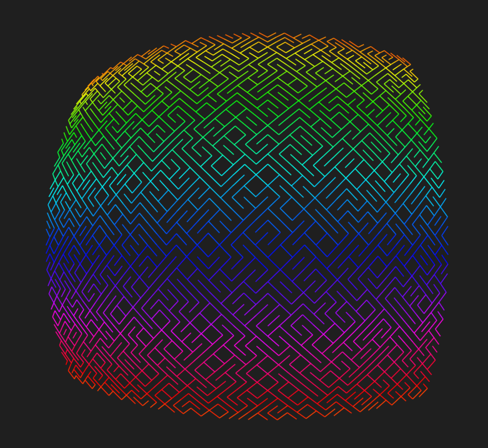

 

# GOTO 10

  Inspired on the Commodore64 program // 10 PRINT CHR$(205.5+RND(1)); : GOTO 10
  http://codepen.io/pjkarlik/pen/ZpzYvP

  This was created for the https://blog.codepen.io/2016/08/26/goto-10/ blog post from codepen.io
  My WIP version using Canvas and JavaScript to emulate the look and feel of the original program.

## Change Log
  * AltRender - what's on my Codepen.io http://codepen.io/pjkarlik/pen/ZpzYvP
  * Initial Commit - Create Points / Render lines.

## Run the example
  Requires Node v7.0.0 or greater

```bash
$ npm install
$ npm run dev & open http://localhost:9090
```

## License

[MIT]
